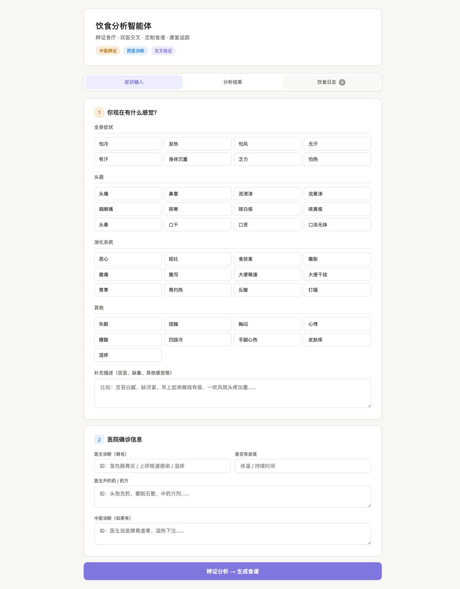

# 饮食分析智能体

> 不是让你忌口，是让你在能吃的范围内吃得开心。

[](https://soneei.github.io/diet-assistant/%E9%A5%AE%E9%A3%9F%E5%88%86%E6%9E%90%E6%99%BA%E8%83%BD%E4%BD%93.html)
[](LICENSE)

一个基于**中医辨证 + 西医诊断交叉验证**的饮食分析与食谱定制系统。

---

## 怎么用

### 🚀 在线使用（推荐）

点这里 → **[饮食分析智能体](https://soneei.github.io/diet-assistant/%E9%A5%AE%E9%A3%9F%E5%88%86%E6%9E%90%E6%99%BA%E8%83%BD%E4%BD%93.html)**

打开即用，无需安装。选症状、填诊断、看食谱。

### 📦 本地运行

```bash
git clone https://github.com/soneei/diet-assistant.git
cd diet-assistant
open 饮食分析智能体.html   # macOS
# Windows/Linux: 双击 饮食分析智能体.html
```

---

## 截图



---

## 核心功能

**问** — "我能吃XXX吗？" → 西医分析 + 中医分析 + 替代方案 + 报告卡

**定** — "帮我安排明天饮食" → 根据体质生成三餐 + 一周食谱 + 食疗方

**记** — "刚吃了XXX，感觉……" → 自动记录 → 形成你的食物-身体敏感度画像

### 内置中医辨证体系（11种）

风寒感冒 · 风热感冒 · 脾胃虚寒 · 脾胃湿热 · 湿热下注 · 食积停滞 · 痰湿内蕴 · 气虚 · 阴虚 · 肝郁气滞 · 病后恢复期

## 竞品差异

市面上的饮食类产品（Zoe、Noom、薄荷健康、汤头APP）都没有同时做到：
- ✅ 中医辨证 + 西医诊断交叉验证
- ✅ 有限食材内的好吃个性化
- ✅ 对话式的持续追踪

---

## 后续规划

- [ ] **快乐层** — 同食材不同做法、安全调味库
- [ ] **外卖筛选** — 根据体质过滤外卖菜品
- [ ] **更多体质** — 扩展辨证知识库

> 欢迎提交 [Issue](https://github.com/soneei/diet-assistant/issues) 或 PR！

---

Created with ❤️ by [soneei](https://github.com/soneei)
